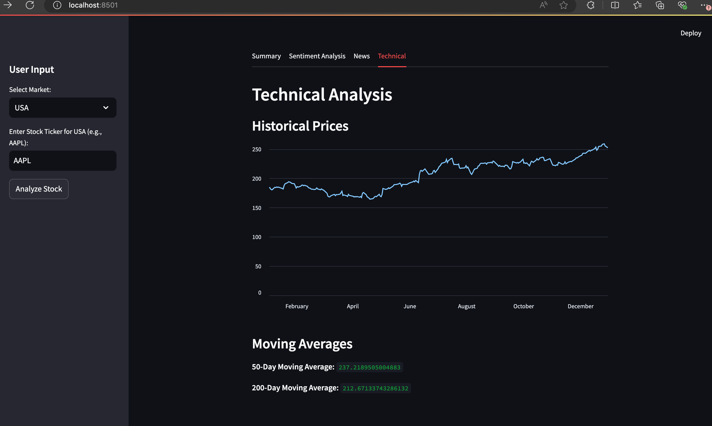

# Stock Analysis App 📈

A Streamlit-based web application for analyzing stocks from **USA**, **Singapore**, and **India (NSE/BSE)**. The app provides comprehensive insights into a stock's fundamentals, technicals, sentiment, and recent news. It also uses **OpenAI API** for generating summaries and sentiment analysis.

## Features ✨

1. **Market Selection**:
   - Supports stocks from **USA**, **Singapore**, **India (NSE)**, and **India (BSE)**.

2. **Stock Information**:
   - Displays basic information (e.g., company name, sector, market cap) and key fundamentals (e.g., P/E ratio, EPS, dividend yield).

3. **Analysis Tabs**:
   - **Summary**: Provides a quick summary and analyst recommendations.
   - **Sentiment Analysis**: Analyzes the stock's sentiment based on recent news and data.
   - **News**: Displays up to 5 recent news articles related to the stock.
   - **Technical Analysis**: Shows historical prices and moving averages.

4. **AI-Powered Insights**:
   - Uses **Google Gemini LLM** to generate summaries and sentiment analysis.

5. **User-Friendly Interface**:
   - Simple and intuitive design with expandable sections for positive and negative sentiments.

6. **Error Handling**:
   - Provides clear error messages and suggestions if the user enters an invalid ticker.

## How to Use 

1. **Install Dependencies**:
   - Install the required Python packages using the `requirements.txt` file:
     ```bash
     pip install -r requirements.txt
     ```

2. **Set Up Environment Variables**:
   - Create a `.env` file in the root directory and add your **OpenAI API key**:
     ```env
     OPENAI_API_KEY=your_openai_api_key
     ```

3. **Run the App**:
   - Start the Streamlit app by running:
     ```bash
     streamlit run app.py
     ```

4. **Use the App**:
   - Select a market (USA, Singapore, India (NSE), India (BSE)).
   - Enter a stock ticker (e.g., `AAPL` for USA, `D05.SI` for Singapore, `RELIANCE.NS` for India (NSE)).
   - Click **Analyze Stock** to view the analysis.

## Example Tickers 

- **USA**: `AAPL`, `TSLA`, `GOOGL`
- **Singapore**: `D05.SI`, `O39.SI`, `U11.SI`
- **India (NSE)**: `RELIANCE.NS`, `TCS.NS`, `HDFCBANK.NS`
- **India (BSE)**: `RELIANCE.BO`, `TCS.BO`, `HDFCBANK.BO`

## Requirements 📋

The app requires the following Python packages:

- `streamlit`
- `yfinance`
- `pandas`
- `openai`
- `duckduckgo-search`
- `python-dotenv`

You can install them using the `requirements.txt` file.

## Screenshots 📸

### Home Page


### Stock Analysis


### Sentiment Analysis


### News Tab


### Technical Analysis


## Contributing 🤝

Contributions are welcome! If you'd like to improve the app, feel free to open an issue or submit a pull request.

## License 📄

This project is licensed under the MIT License. See the [LICENSE](LICENSE) file for details.

---

Enjoy analyzing stocks with this app! 